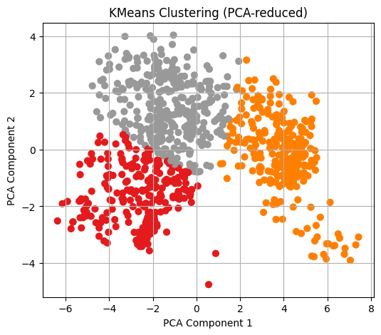
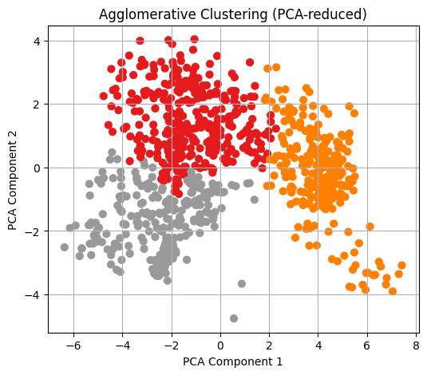
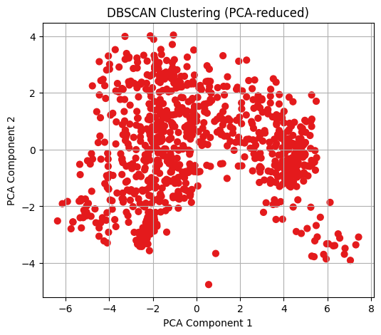

# Unsupervised Vehicle Clustering

Exploratory **segmentation analysis** on geometric silhouette data of vehicles.  
Pipeline: clean → validate → **PCA** → **cluster** → evaluate.

## Key Features
- Normalization + **PCA** to build validated, model-ready datasets  
- Reproducible pipelines for clustering analysis  
- Tested clustering methods (**K-Means**, **DBSCAN**)  
- Emphasis on **data validation**, reproducibility, and performance evaluation

## Tools & Tech
- Python: `pandas`, `numpy`, `scikit-learn`, `matplotlib`, `seaborn`  
- Jupyter/Colab

## Repo Structure
```
repo/
├─ notebooks/
│  └─ vehicle_clustering.ipynb
├─ outputs/
│  ├─ pca_scatter.png
│  ├─ kmeans_clusters.png
│  └─ dbscan_clusters.png
├─ requirements.txt
└─ README.md
```

## How to Run
```bash
python -m venv .venv
# Windows: .venv\Scripts\activate
# macOS/Linux: source .venv/bin/activate
pip install -r requirements.txt
jupyter lab
# open notebooks/vehicle_clustering.ipynb
```

## Example Visuals
  
  


## Notes
- Large/raw data is ignored; include only tiny **SAMPLE** files if needed for demo.
